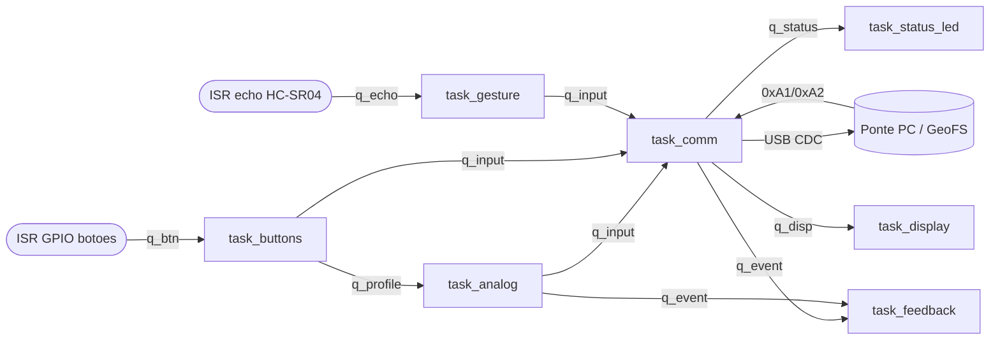

# APS-2 — Controle para GeoFS

Controle físico (gamepad/yoke) para o flight simulator **[GeoFS](https://www.geo-fs.com/)**,
construído sobre **Raspberry Pi Pico 2 (RP2350) + FreeRTOS**. O controle lê joystick,
potenciômetro e botões, reconhece **gestos sem toque** com um sensor ultrassônico + **IA on-device
(Edge Impulse)**, mostra um dashboard num **OLED**, dá **feedback háptico** (buzzer + vibração) e se
comunica com o PC por uma **ponte Python** que injeta teclado/mouse no navegador.

> Disciplina: Computação Embarcada (Insper). Enunciado:
> https://insper-embarcados.github.io/site/entregas/aps-2-controle.html

---

## 1. Jogo-alvo

**GeoFS** — simulador de voo que roda no navegador. O controle mapeia:

| Comando de voo | Entrada no controle |
|----------------|---------------------|
| Pitch / Roll (manche) | Joystick analógico (2 eixos) → mouse |
| Throttle | Potenciômetro linear → `PageUp`/`PageDown` |
| Trem de pouso (`G`) | Botão GEAR |
| Flaps (`F`) | Botão FLAPS |
| Freio (`B`) | Botão BRAKE |
| Spoiler / Autopilot / câmera | **Gestos sem toque** (HC-SR04 + Edge Impulse) |
| Perfil de sensibilidade | Botão VIEW (cicla Suave/Normal/Sport) |
| Macro (gravar/reproduzir) | Clique do joystick (curto = reproduz, longo = grava) |

---

## 2. Projeto mecânico (conceito)

Caixa impressa em 3D em formato de yoke/joystick de mesa: o joystick e o potenciômetro de throttle
ficam sob as mãos, os botões de voo no topo, o HC-SR04 voltado para cima (gestos passando a mão por
cima), o OLED na frente e a bateria 1S interna.

> _Coloque aqui os sketches e fotos:_
> `docs/sketch-proposta.png`, `docs/foto-final.jpg`.

---

## 3. Componentes (I/O)

**Entradas analógicas (ADC):**
- Joystick eixo X → GP26 / ADC0
- Joystick eixo Y → GP27 / ADC1
- Potenciômetro (throttle) → GP28 / ADC2
- Bateria (VSYS) → GP29 / ADC3

**Entradas digitais (todas por interrupção/ISR, ativas em baixo):**
- GEAR → GP10, FLAPS → GP11, BRAKE → GP12, VIEW → GP13, clique do joystick → GP9

**Sensor da IA:**
- HC-SR04 ultrassônico → TRIG GP14, ECHO GP15 (echo via divisor para 3V3)

**Saídas:**
- LED RGB de status de conexão → GP20/GP21/GP22
- Buzzer (PWM) → GP18 · Motor de vibração → GP19
- OLED SSD1306 (I2C0) → SDA GP4, SCL GP5

Pinos centralizados em [main/pins.h](main/pins.h).
**Guia de montagem (esquema de ligação de cada componente):** [docs/montagem.md](docs/montagem.md).

---

## 4. Protocolo de comunicação

**Device → PC** (4 bytes, sync no início):

```
[0xFF][TYPE][VAL_LO][VAL_HI]      VAL = int16 little-endian
```

| TYPE | Significado | VAL |
|------|-------------|-----|
| 0 | eixo X (roll) | deflexão |
| 1 | eixo Y (pitch) | deflexão |
| 2 | throttle | 0..1000 |
| 3 | botão | id (0=GEAR,1=FLAPS,2=BRAKE) |
| 4 | gesto | id (1=swipe_up,2=swipe_down,3=hover) |

**PC → Device** (1 byte): `0xA0` heartbeat (acende o LED de “conectado”), `0xA1` crash, `0xA2` stall
(disparam vibração/buzzer — feedback do jogo).

A bateria (TYPE 5) é tratada internamente (OLED + aviso), não vai ao PC.

---

## 5. Arquitetura de firmware (RTOS, sem variáveis globais)

A comunicação entre tasks/ISR é feita **somente por filas e semáforos** (os _handles_ são `static`
para a ISR alcançá-los; nenhum dado de aplicação é global). Código em [main/main.c](main/main.c).



**Tasks**

| Task | Core | Função |
|------|------|--------|
| `task_analog` | 0 | ADC joystick/pot/bateria; calibração no boot; aplica perfil |
| `task_buttons` | 0 | Botões por ISR; debounce; perfis; macro (gravar/reproduzir) |
| `task_gesture` | **1** | HC-SR04 (ISR/alarme) + classificador Edge Impulse |
| `task_comm` | 0 | Datagrama pela USB; heartbeat/crash/stall; roteia p/ display/feedback |
| `task_display` | 0 | OLED SSD1306 (mutex I2C) |
| `task_feedback` | 0 | Buzzer + motor de vibração |
| `task_status_led` | 0 | LED RGB de conexão |

**Primitivas:** filas `q_input`, `q_btn`, `q_echo`, `q_status`, `q_disp`, `q_event`, `q_profile`;
**mutex** `mtx_i2c` (barramento I2C); **semáforo via ISR** de GPIO; **ISR** de botões e do echo do
HC-SR04 (`xQueueSendFromISR` + `portYIELD_FROM_ISR`).

**Lab RTOS expert (SMP multicore):** o firmware roda em **2 cores**
(`configNUMBER_OF_CORES=2`, FreeRTOS SMP). A IA (DSP + classificador), que é a carga mais pesada, é
fixada no **core 1** via `vTaskCoreAffinitySet`; as tasks de controle de tempo-real ficam no
**core 0**, evitando que a inferência cause jitter no laço de controle.

---

## 6. IA on-device — Edge Impulse + HC-SR04 (gestos sem toque)

O classificador roda no Pico ([main/gesture.cpp](main/gesture.cpp), API C em
[main/gesture.h](main/gesture.h)). Enquanto não há modelo treinado, um **stub** retorna `idle` e
**tudo continua compilando**. Para treinar e ativar o modelo real:

1. **Coletar dados** — compile no modo data-forwarder e use o
   [edge-impulse data-forwarder](https://docs.edgeimpulse.com/docs/cli-data-forwarder):
   ```bash
   cmake -S . -B build -G Ninja -DPICO_BOARD=pico2 -DEI_DATA_FORWARDER=ON
   # grave o .uf2, depois:
   edge-impulse-data-forwarder   # le a distancia do HC-SR04 pela serial
   ```
   Rotule os gestos (`idle`, `swipe_up`, `swipe_down`, `hover`).
2. **Treinar e exportar** no Edge Impulse Studio → **Deployment → C++ library**.
3. **Vendorizar** o pacote exportado em `ei-model/` (contém `edge-impulse-sdk/`, `tflite-model/`,
   `model-parameters/`). Ajuste `GESTURE_WINDOW` em [main/main.c](main/main.c) para casar com
   `EI_CLASSIFIER_RAW_SAMPLE_COUNT`.
4. **Compilar com o modelo:**
   ```bash
   cmake -S . -B build -G Ninja -DPICO_BOARD=pico2 -DHAS_EI_MODEL=ON
   ```

---

## 7. Ponte PC + GeoFS

```bash
cd pc-bridge
python -m venv venv && venv\Scripts\activate      # Windows
pip install -r requirements.txt
python main.py
```

Selecione a porta serial, clique em **Conectar** e abra o GeoFS. O joystick controla o manche
(mouse absoluto), o potenciômetro o throttle, e os botões/gestos viram teclas.

**Feedback do jogo (opcional):** instale [pc-bridge/geofs_feedback.user.js](pc-bridge/geofs_feedback.user.js)
no Tampermonkey. Ele lê `geofs.aircraft.instance` e avisa a ponte em `127.0.0.1:8765` quando há
crash/stall → o controle vibra.

---

## 8. Build do firmware

Pela extensão **Raspberry Pi Pico** do VS Code (recomendado) ou na linha de comando:

```bash
cmake -S . -B build -G Ninja -DPICO_BOARD=pico2
cmake --build build
# grave build/main/pico_emb.uf2 (BOOTSEL)
```

CI: [build.yml](.github/workflows/build.yml), [cppcheck.yml](.github/workflows/cppcheck.yml),
[embedded-check.yml](.github/workflows/embedded-check.yml) (roda sobre `main/main.c`, `rtos: true`).

---

## 9. Requisitos do enunciado e pontos extras

**Obrigatórios:** arquitetura RTOS sem globais ✔ · ≥2 entradas analógicas (4 ADC) ✔ ·
≥4 entradas digitais por interrupção (5 botões) ✔ · indicador de conexão (LED RGB) ✔ ·
tasks/filas/semáforos/ISR ✔ · bateria integrada ✔.

**Pontos extras implementados:**
- ✔ **Expert-1 (display OLED)** — dashboard SSD1306
- ✔ **Componente novo** — HC-SR04 (gestos sem toque)
- ✔ **Wizard de calibração** — centragem do joystick no boot, com LED
- ✔ **Perfis multiusuário** — Suave/Normal/Sport (botão VIEW)
- ✔ **Botão macro** — gravar/reproduzir (clique do joystick)
- ✔ **Haptics** — buzzer + vibração em eventos locais
- ✔ **Feedback do jogo** — crash/stall do GeoFS → vibração (userscript)
- ✔ **Gestão de bateria** — leitura por ADC, nível no OLED, aviso
- ⚙️ **IA on-device (Edge Impulse)** — estrutura pronta; ativar com o modelo treinado
- ▢ **Vídeo profissional** e **design industrial** — entregáveis de mídia/CAD (a fazer)

---

## 10. Estrutura

```
main/            firmware (main.c, pins.h, gesture.h/.cpp, CMakeLists.txt)
ssd1306_lib/     driver do OLED (vendorizado)
ei-model/        modelo Edge Impulse exportado (adicionar após treinar)
pc-bridge/       ponte Python + userscript do GeoFS
```
