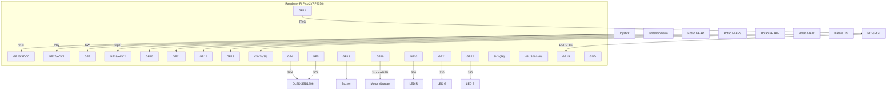

# Guia de montagem — Controle GeoFS (Raspberry Pi Pico 2)

Esquema de ligação de todos os componentes. Os GPIOs estão em [../main/pins.h](../main/pins.h);
se mudar a fiação, ajuste lá. O Pico 2 tem 40 pinos físicos (mesma pinagem do Pico 1).

> ⚠️ **Sempre ligue todos os GND juntos** (controle, sensores e Pico no mesmo terra).

---

## 1. Tabela rápida (componente → GPIO → pino físico)

| Componente | Sinal | GPIO | Pino físico | Observação |
|------------|-------|------|-------------|------------|
| Joystick | VRx (eixo X) | GP26 / ADC0 | 31 | analógico |
| Joystick | VRy (eixo Y) | GP27 / ADC1 | 32 | analógico |
| Joystick | SW (clique) | GP9 | 12 | botão (macro), pull-up interno |
| Potenciômetro | wiper | GP28 / ADC2 | 34 | throttle |
| Botão GEAR | — | GP10 | 14 | pull-up interno |
| Botão FLAPS | — | GP11 | 15 | pull-up interno |
| Botão BRAKE | — | GP12 | 16 | pull-up interno |
| Botão VIEW | — | GP13 | 17 | cicla perfil, pull-up interno |
| HC-SR04 | TRIG | GP14 | 19 | saída 3V3 (ok p/ o sensor) |
| HC-SR04 | ECHO | GP15 | 20 | **divisor se sensor for 5V** |
| OLED SSD1306 | SDA | GP4 | 6 | I2C0 |
| OLED SSD1306 | SCL | GP5 | 7 | I2C0 |
| Buzzer | + | GP18 | 24 | PWM (tom) |
| Motor vibração | controle | GP19 | 25 | **via transistor** |
| LED status | R | GP20 | 26 | + resistor 330 Ω |
| LED status | G | GP21 | 27 | + resistor 330 Ω |
| LED status | B | GP22 | 29 | + resistor 330 Ω |
| Bateria | leitura | ADC3 (interno) | — | lê VSYS/3 (sem fio extra) |

**Alimentação:** `3V3(OUT)` = pino 36 · `VBUS` (5V do USB) = pino 40 · `VSYS` = pino 39 ·
`GND` = pinos 3, 8, 13, 18, 23, 28, 38.

---

## 2. Ligação por componente

### Joystick analógico (módulo tipo KY-023)
```
Joystick   ->   Pico
  +5V/VCC  ->   3V3 (pino 36)
  GND      ->   GND
  VRx      ->   GP26 (pino 31)
  VRy      ->   GP27 (pino 32)
  SW       ->   GP9  (pino 12)   (o firmware liga pull-up; SW fecha p/ GND)
```

### Potenciômetro linear (throttle)
```
  terminal 1  ->  3V3 (pino 36)
  terminal 2  ->  GND
  wiper (meio)->  GP28 (pino 34)
```

### Botões (GEAR/FLAPS/BRAKE/VIEW)
Cada botão liga **um lado no GPIO e o outro no GND**. Não precisa resistor: o firmware usa
**pull-up interno** (apertado = nível 0, detectado por interrupção).
```
  GEAR  : GP10 (14) --[botão]-- GND
  FLAPS : GP11 (15) --[botão]-- GND
  BRAKE : GP12 (16) --[botão]-- GND
  VIEW  : GP13 (17) --[botão]-- GND
```

### HC-SR04 (sensor de gestos da IA)
**Opção A — sensor 3,3 V (recomendado: HC-SR04+ / RCWL-1601):** alimente por 3V3, sem divisor.
```
  VCC  -> 3V3 (pino 36)
  GND  -> GND
  TRIG -> GP14 (pino 19)
  ECHO -> GP15 (pino 20)   (já é 3V3, ligação direta)
```
**Opção B — HC-SR04 clássico (5 V):** alimente por VBUS (5V) e **abaixe o ECHO** para 3V3 com um
divisor resistivo (senão o GP15 recebe 5V e pode danificar):
```
  VCC  -> VBUS 5V (pino 40)
  GND  -> GND
  TRIG -> GP14 (pino 19)
  ECHO -> [R1 1kΩ] -> GP15 (pino 20)
  GP15 -> [R2 2kΩ] -> GND      (5V * 2k/(1k+2k) ≈ 3,3V)
```

### OLED SSD1306 (I2C, endereço 0x3C)
```
  VCC -> 3V3 (pino 36)
  GND -> GND
  SDA -> GP4 (pino 6)
  SCL -> GP5 (pino 7)
```

### LED RGB de status (cátodo comum)
Cada cor com **resistor de 330 Ω** em série; cátodo comum no GND.
```
  R -> [330Ω] -> GP20 (26)
  G -> [330Ω] -> GP21 (27)
  B -> [330Ω] -> GP22 (29)
  comum -> GND
```
> Se o seu LED for **ânodo comum**, ligue o comum no 3V3 e troque `LED_ACTIVE_HIGH` para `0`
> em [../main/pins.h](../main/pins.h).

### Buzzer (PWM)
Buzzer **passivo** (piezo) pode ir direto (consome pouco):
```
  GP18 (24) -> buzzer (+) -> buzzer (−) -> GND
```
Buzzer magnético/alto-falante mais forte: use o mesmo transistor do motor (abaixo).

### Motor de vibração — **precisa de transistor** (GPIO não aciona motor direto)
NPN (2N2222) ou MOSFET (2N7000). Com diodo de roda-livre (1N4148) no motor:
```
  GP19 (25) --[1kΩ]--> base (NPN)
  motor (+) -> 3V3 (ou 5V)        ↘ diodo 1N4148 em paralelo com o motor
  motor (−) -> coletor              (catodo no +, anodo no coletor)
  emissor   -> GND
```

### Bateria (LiPo 1S) e leitura de nível
Alimente o Pico pela **VSYS** (pino 39). O nível é lido **internamente** pelo ADC3 (VSYS/3) — não
precisa fio nem divisor externo. O firmware usa `VBAT_DIVIDER = 3.0`.
```
  Bateria (+) -> VSYS (pino 39)   (ideal: através de um diodo Schottky)
  Bateria (−) -> GND
```
> ⚠️ Com o USB conectado, a VSYS fica ~4,7 V (vem do VBUS): a leitura de bateria só é fiel
> quando o controle está **rodando na bateria**. Pico 2 **não‑W** expõe a VSYS no ADC3;
> no Pico 2 **W** o ADC3 é usado pelo Wi-Fi e a leitura não funciona.

---

## 3. Diagrama de conexões



---

## 4. Checklist de montagem
- [ ] Todos os GND no mesmo terra (Pico + componentes + bateria).
- [ ] Joystick/pot/OLED alimentados em **3V3**.
- [ ] HC-SR04: se for 5V, **divisor no ECHO**; se for 3,3V, direto.
- [ ] LED RGB com resistores; confirmar cátodo/ânodo comum (`LED_ACTIVE_HIGH`).
- [ ] Motor de vibração com **transistor + diodo** (nunca direto no GPIO).
- [ ] Bateria na VSYS (com diodo). Testar leitura **fora do USB**.
- [ ] Gravar o `.uf2`, abrir a ponte PC e validar cada entrada/saída.
